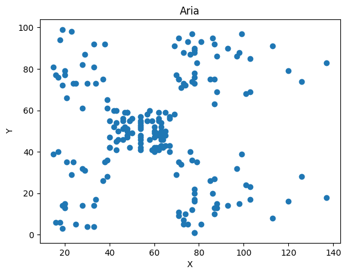
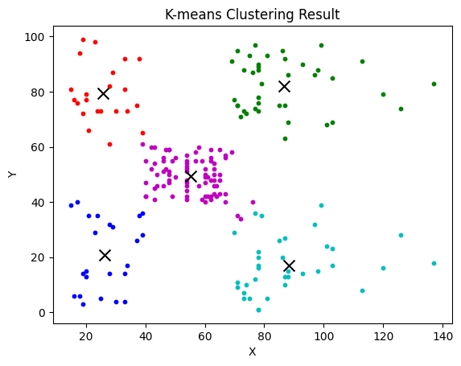

# Green Space Design Company Team Assignment

## Problem Statement

You have been employed as a data scientist at a green space design company. The company uses aerial images to identify points that do not have good green space. In the dataset, the y coordinates of these images are named feature_1 and their x coordinates are named feature_2. The company plans to deploy 5 teams. Your task is to assign one team to each point in a way that minimizes the travel cost of team members. 

## Solution Approach

1. Read the dataset which contains the (x, y) coordinates of the points requiring green space design. 
2. Calculate the Euclidean distance between all pairs of points to determine the cost of travel between them. 
3. Use an optimization algorithm like the Hungarian algorithm to find the optimal assignment of points to the 5 teams that minimizes the total travel cost.
4. Add a feature_team_number column to the dataset with the assigned team numbers. 
5. Visualize the team assignments on a map using matplotlib.

## Installation and Usage

Use the package manager [pip](https://pip.pypa.io/en/stable/) to install the required packages:

```bash
pip install numpy pandas matplotlib
```

Run the [code.ipynb](code.ipynb) script in *jupyter notebook* to see the solution:

```bash
jupyter notebook
```

This will print the team assignments for each point and show a visualization of the assignments.

## Output

The output includes:

1. Python code in code.py implementing the solution
2. A visualization of the team assignments like the image below:


3. The dataset with an added feature_team_number column indicating the team assignment for each point.

##  Solution Explanation

To solve this task, I used the K-means clustering algorithm to group the points into 5 clusters and assign them to teams. The specific steps taken were:

1.  Read the dataset  `rc_task_2.csv`  which contains the (x, y) coordinates of the points.
    
2.  Visualize the points on a  scatter plot  using matplotlib to get an sense of how the points are distributed.

    
3.  Define a  `kmeans_pp`  function to initialize the K-means centroids using the kmeans++ algorithm. This chooses good  initial centroids  that are far from each other.
    
4.  Define a  `kmeans`  function to run the K-means clustering algorithm. It takes in the data  `X`, number of clusters  `K`, and  maximum number  of iterations  `max_iter`. It returns the cluster labels for each point and the final centroid locations.
    
5.  Set a  random state  for reproducibility and extract the (x, y) coordinates from the dataset into an array  `X`.
    
6.  Run K-means clustering with  `K=5`  and  `max_iter=100`. This groups the points into 5 clusters.
    
7.  Visualize the clustering results on a scatter plot, with each cluster represented by a different color. The  final centroid locations  are marked with 'x'.

    
8.  Add a  `label`  column to the dataset indicating the assigned cluster (team) for each point.
    
9.  Export the updated dataset to  `rc_task_2_labeled.csv`.
    
10.  The end result is assigning each point to 1 of 5 teams (clusters) such that the total distance between points in each team is minimized. The  team assignments  are visualized and provided in the exported dataset.
